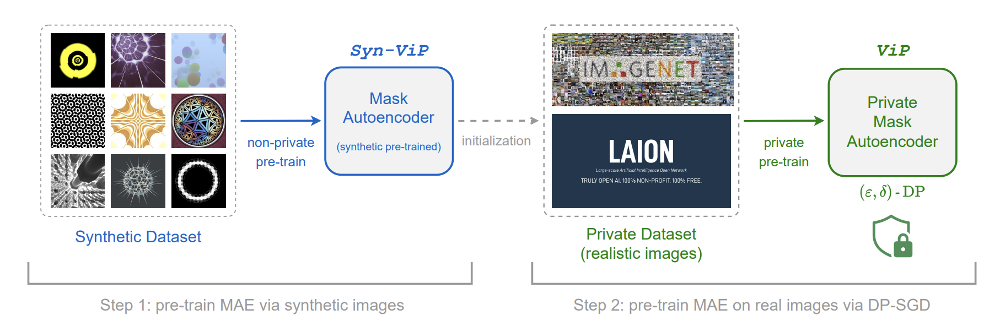

## ViP - *Vi*sion transformer with differential *P*rivacy: A PyTorch Implementation

This is a PyTorch implementation of the paper:

**ViP: A Differentially Private Foundation Model for Computer Vision** [[paper link](https://arxiv.org/abs/2306.08842)]

[Yaodong Yu](https://yaodongyu.github.io) (UC Berkeley, Meta AI), [Maziar Sanjabi](https://sites.google.com/view/maziar) (Meta AI), [Yi Ma](http://people.eecs.berkeley.edu/~yima/) (UC Berkeley), [Kamalika Chaudhuri](https://cseweb.ucsd.edu/~kamalika/) (Meta AI), and [Chuan Guo](https://sites.google.com/view/chuanguo) (Meta AI).

### Setup
* This repo is a modification on the [MAE repo](https://github.com/facebookresearch/mae). Installation and preparation follow that repo.
* For differentially private training, we utilize [opacus](https://github.com/pytorch/opacus) and [functorch](https://github.com/pytorch/functorch) libraries.
* To ensure our model is compatible with DP training, we use ``timm==0.6.12``.

### How to pre-train differentially private transformers (ViP) with self-supervised learning?


The below figure presents an overview of the pipeline for our proposed recipe for training DP foundation vision models -- **ViP**:

<p align="center">
    
</p>
<p align="center">

In Step 1, we first pre-train a [MAE](https://arxiv.org/abs/2111.06377) model on synthetic images with standard optimizers (e.g., SGD, AdamW). We denote this model by *(Syn)-ViP*. In Step 2, we use the MAE model pre-trained on synthetic images as initialization, and then apply differential private optimizers (e.g., DP-SGD, DP-AdamW) to train a **ViP** model that satisfies (ϵ, δ)-DP.

### Differentially Private Pre-training ViP 

The differentially private (DP) pre-training instruction is in [PRETRAIN.md](PRETRAIN.md).

### DP Pre-trained ViP checkpoints

The following table provides the pre-trained checkpoints used in the paper:
<table><tbody>
<!-- START TABLE -->
<!-- TABLE HEADER -->
<th valign="bottom"></th>
<th valign="bottom">ViP-Syn-Base (Encoder & Decoder)</th>
<th valign="bottom">ViP-Base (ViT Encoder)</th>
<!-- TABLE BODY -->
<tr><td align="left">pre-trained checkpoint</td>
<td align="center"><a href="https://dl.fbaipublicfiles.com/vip/ckpt-vip-syn-base.pth">download link</a></td>
<td align="center"><a href="https://dl.fbaipublicfiles.com/vip/ckpt-vip-laion233m-base.pth">download link</a></td>
</tr>
</tbody></table>

- To load the ViP-Syn-Base (MAE encoder & decoder), please refer to the ``main_pretrain_vip.py`` script.
- To load the ViP-Base (MAE encoder), please refer to the ``main_linprobe.py`` script.

### Evaluations of DP Pre-trained ViP using Linear Probing (LP) and Fine-tuning (FT)

For instructions on linear probing and fine-tuning, please refer to the [EVAL_LP_FT.md](EVAL_LP_FT.md).

### Reference
For technical details and full experimental results, please check the [paper](https://arxiv.org/abs/2306.08842). Please consider citing our work if you find it helpful to yours:

```
@Article{ViP2023,
  author  = {Yaodong Yu and Maziar Sanjabi and Yi Ma and Kamalika Chaudhuri and Chuan Guo},
  journal = {arXiv:2306.08842},
  title   = {ViP: A Differentially Private Foundation Model for Computer Vision},
  year    = {2023},
}
```


### Code Acknowledgements

The majority of ViP-MAE is licensed under CC-BY-NC, however portions of the project are available under separate license terms: [Opacus](https://github.com/pytorch/opacus) is licensed under Apache 2.0, while [Shaders21k](https://github.com/mbaradad/shaders21k/tree/main/image_generation/shaders) is also licensed under CC-BY-NC. Note that due to the non-commercial nature of the CC-BY-NC license, this code is **not** ready for production use.
